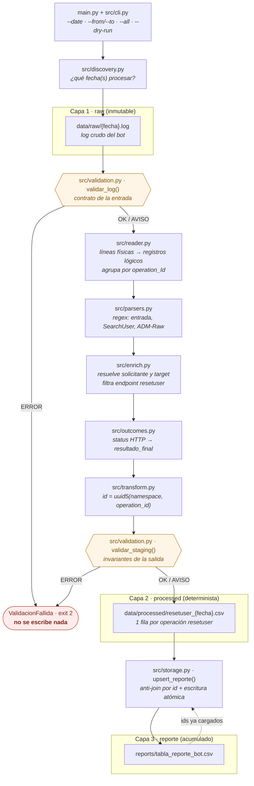
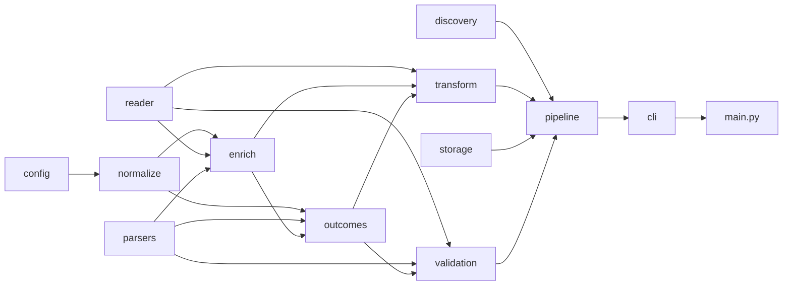

# tabla_reporte_bot

Proceso de datos que convierte los `.log` crudos de un bot de reseteo de contraseñas en una
tabla analítica acumulada, `tabla_reporte_bot`.

## Resumen

El bot atiende varias operaciones sobre Active Directory. Este proceso reporta
**únicamente** los reseteos de ADManager (`users_admin/resetuser`) y traduce el código HTTP
con el que terminó cada operación a una explicación en lenguaje natural
(`resultado_final`), de modo que soporte y negocio entiendan qué ocurrió sin abrir el log.

El punto delicado de la entrada es que **un registro del log no equivale a una línea del
archivo**: los bloques `Raw Response: {...}` continúan en líneas sin encabezado, y las
operaciones pueden intercalarse entre sí. El proceso reconstruye los registros lógicos, los
agrupa por `operation_Id` y sólo entonces aplica reglas de negocio.

| Propiedad | Cómo se consigue |
|---|---|
| **Idempotente** | `id = uuid5(NAMESPACE, operation_id)`; el upsert descarta los ids ya cargados, así que reejecutar un día no duplica ni altera nada |
| **Determinista** | la capa `processed/` no contiene `updated_at` ni ningún valor derivado del reloj: mismo log de entrada, mismo CSV byte a byte |
| **A prueba de fallos** | las validaciones corren **antes** de cualquier escritura, y los CSV se escriben de forma atómica (`.tmp` + `rename`) |
| **Extensible** | un código HTTP nuevo es una función y una entrada en `RESOLVERS` (`src/outcomes.py`); las reglas de negocio viven todas en `src/config.py` |
| **Auditable** | queda el staging por día en `data/processed/`, además de la tabla final |

## Diagrama del pipeline

Arquitectura de tres capas: `raw` (inmutable) → `processed` (staging determinista por día)
→ `reports` (tabla acumulada).



`src/pipeline.py` es el único módulo que conoce el orden de los pasos; el resto son piezas
que él compone. Las dependencias van en una sola dirección, sin ciclos, lo que mantiene las
reglas de negocio fuera de los parsers y las expresiones regulares fuera de las reglas de
negocio. La flecha va del módulo importado al que lo importa:



`config` es transversal: lo importan casi todos los módulos, porque es el único lugar donde
viven las constantes de negocio y las rutas.

## Requisitos

- Python **3.14** (ver `.python-version`)
- [`uv`](https://docs.astral.sh/uv/) para gestionar el entorno y las dependencias
- Dependencias: `pandas`; para desarrollo `pytest`, `ruff`, `ipykernel`

## Ejecutar el pipeline por primera vez

```bash
# 1. Entorno y dependencias (crea .venv a partir de pyproject.toml + uv.lock)
uv sync

# 2. Cargar los datos: los .log crudos van a data/raw/, nombrados <YYYY-MM-DD>.log
cp /ruta/a/los/logs/*.log data/raw/
# data test
# cp tests/fixtures/*.log data/raw/

# 3. Validar sin escribir nada (revisa el contrato del log e informa qué se cargaría)
uv run python main.py --all --dry-run

# 4. Carga inicial de todo el histórico: escribe el staging y crea el reporte
uv run python main.py --all

# 5. Correr para un día específico (reprocesar o recuperar una fecha)
uv run python main.py --date 2026-08-30
```

A partir de aquí, la **ejecución diaria normal** no necesita argumentos: toma el `.log` más
reciente de `data/raw/`.

```bash
uv run python main.py
```

Salida esperada de una ejecución:

```
2026-09-08 10:17:57 | INFO    | Fechas a procesar: 2026-01-01
2026-09-08 10:17:57 | INFO    | 2026-01-01: 12 operaciones resetuser, 12 registros nuevos

Resumen de la ejecución
fecha         operaciones   nuevos
----------------------------------
2026-01-01             12       12
----------------------------------
total                  12       12

Reporte: .../reports/tabla_reporte_bot.csv (12 filas)
```

Volver a correr esa misma fecha reporta `0` registros nuevos y deja el archivo intacto: esa
es la garantía de idempotencia.

> Sin `uv`, el equivalente es activar el entorno y usar `python main.py …` directamente
> (`.venv\Scripts\activate` en Windows, `source .venv/bin/activate` en Linux/macOS).

### Probarlo sin datos reales

El repositorio incluye un log sintético con un caso por cada código HTTP:

```bash
cp tests/fixtures/2026-01-01.log data/raw/
uv run python main.py --date 2026-01-01 --dry-run   # 12 operaciones resetuser
```

## Opciones de la línea de comandos

| Comando | Para qué sirve |
|---|---|
| `python main.py` | ejecución diaria: procesa el log más reciente |
| `python main.py --date 2026-08-30` | reprocesa una fecha concreta |
| `python main.py --from 2026-08-29 --to 2026-08-31` | recuperación de un rango (inclusivo) |
| `python main.py --all` | carga inicial de todo el histórico disponible |
| `python main.py --dry-run` | informa qué se cargaría, sin escribir en disco |
| `python main.py --strict` | cualquier aviso detiene el proceso, no sólo los errores |
| `python main.py -v` / `-q` | detalle de cada paso / sólo errores |

Códigos de salida, pensados para un orquestador (cron, Airflow, etc.):

| Código | Significado |
|---|---|
| `0` | ejecución correcta |
| `1` | argumentos inválidos o el `.log` de la fecha no existe |
| `2` | los datos no pasaron las validaciones; **no se escribió nada** |

## Esquema de salida

`reports/tabla_reporte_bot.csv` — una fila por operación `resetuser`, ordenada por
(`timestamp`, `id`):

| Columna | Descripción |
|---|---|
| `id` | `uuid5(namespace, operation_id)`: único, válido y estable entre ejecuciones y máquinas |
| `updated_at` | momento de carga del registro (`America/Mexico_City`); no cambia al reprocesar |
| `timestamp` | marca de tiempo de la operación en el log |
| `operation_id` | identificador de la operación en el log (trazabilidad hacia `data/raw/`) |
| `solicitante` / `target` | `sAMAccountName` de quien pide el reseteo y de quien lo recibe |
| `accion` / `sistema` | `reset_password` / `ADManager` |
| `nombre_solicitante` / `nombre_target` | `FIRST_NAME + LAST_NAME` según ADManager |
| `oficina_solicitante` / `oficina_target` | campo `OFFICE` de ADManager |
| `resultado_final` | explicación en lenguaje natural del desenlace de la operación |

El staging por día (`data/processed/resetuser_<fecha>.csv`) lleva las mismas columnas
**sin** `updated_at` (para ser determinista) y **con** `status_http` (para depurar y para
las validaciones de cobertura).

El detalle de los campos del log de entrada está en
[references/log_dict.md](references/log_dict.md); la exploración que dio origen a los
módulos, en [notebooks/main.ipynb](notebooks/main.ipynb).

## Validaciones

No hay que confundirlas con las pruebas: `tests/` comprueba que el **código** es correcto
con datos fijos y conocidos; `src/validation.py` comprueba que los **datos de hoy** son los
esperados. Si falla un test se corrige el código; si falla una validación, hay que revisar
el log de entrada.

- `validar_log()` — contrato de la entrada: archivo no vacío, encabezados reconocibles, una
  sola línea de entrada por operación, endpoints conocidos y respuestas de ADManager
  completas.
- `validar_staging()` — invariantes de la salida: `id` único, ninguna fila sin
  `resultado_final`, códigos HTTP con regla definida, `403` con causa identificada y
  operaciones exitosas con datos completos.

Cada hallazgo es un `ERROR` (detiene el proceso) o un `AVISO` (se registra y continúa). Con
`--strict` los avisos también detienen el proceso: en ejecución automatizada suele
preferirse no cargar nada antes que cargar datos dudosos.

## Estructura del proyecto

```
main.py              punto de entrada: interpreta argumentos, lanza el proceso, presenta el resultado
src/                 módulos del pipeline (config, normalize, discovery, reader, parsers,
                     enrich, outcomes, transform, storage, validation, pipeline, cli)
tests/               69 pruebas sobre un log sintético; nunca tocan data/ ni reports/
notebooks/main.ipynb exploración previa a la modularización
references/          diccionario de datos del log
data/raw/            logs crudos de entrada   (ignorado por git)
data/processed/      staging por día          (ignorado por git)
reports/             tabla final acumulada    (ignorado por git)
```

La raíz se deduce de la ubicación de `src/config.py`, así que el proceso funciona desde
cualquier directorio. La variable de entorno `BOT_LOG_REPORT_ROOT` permite apuntar a otro
árbol de datos, que es como las pruebas se aíslan de `data/`.

## Calidad de código

```bash
uv run ruff check .          # análisis estático
uv run ruff format --check   # formato
uv run pytest                # 69 pruebas
```

Aplicar un *hook* pre-commit con:

```Python
ruff check .
ruff format --check
pytest
```

Esta secuencia ejecuta el análisis estático, confirma el formato y corre las pruebas. Si
una etapa falla, el *hook* o el pipeline deben detenerse.

Referencia [Ruff python](https://academify.com.br/es/ruff-python-calidad-codigo/).

## Pendientes técnicos

Lo que sigue son asuntos **conocidos y no resueltos**. La evidencia sale de ejecutar el
proceso sobre los cuatro logs disponibles (`2026-08-29` a `2026-09-01`), no de una revisión
teórica del código: 1238 operaciones `resetuser` y 39 `sap/register_user` descartadas.

Distribución real de estatus, sobre la que se apoyan varios de los puntos:

| status | 200 | 403 | 404 | 500 | 503 | 504 |
|---|---|---|---|---|---|---|
| operaciones | 1108 | 41 | 79 | 1 | 3 | 6 |

| # | Pendiente | Tipo | Prioridad |
|---|---|---|---|
| P1 | Respuesta vacía de ADManager: la fila se degrada en silencio | Correctitud | Alta |
| P2 | `encontrado` mezcla "no existe" con "no se pudo leer" | Correctitud | Alta |
| P3 | Reglas implementadas sin evidencia en datos reales (202, 429, OU bloqueada) | Cobertura | Media |
| P4 | Inconsistencia de `OFFICE` en el origen | Calidad del origen | Media |
| P5 | Mezcla de zonas horarias en la tabla final | Modelado | Media |
| P6 | `status_http` no llega al reporte final | Modelado | Media |
| P7 | El *hook* pre-commit está documentado pero no implementado | Proceso | Media |
| P8 | Las pruebas sólo cubren un log sintético | Pruebas | Media |
| P9 | CSV y upsert de reescritura completa | Escalabilidad | Baja |
| P10 | `sap/register_user` fuera del reporte | Alcance | Baja |

### P1 · Respuesta vacía de ADManager: la fila se degrada en silencio

Caso real, único en los datos actuales: operación `610113353adb8a0c1c67a3d3b5c41989`
(`2026-08-29`), con estatus **500**. La consulta `SearchUser` del solicitante
`admsistemas374` volvió así:

```
Params to execute POST to SearchUser: {... 'filter': '(sAMAccountName:equal:admsistemas374)'},
Raw Response: , Raw status_code: 200, Raw reason_phrase:
```

El cuerpo llegó **vacío** dentro de una línea por lo demás completa: no es un log cortado a
media escritura, es ADManager respondiendo `200` sin contenido. Qué ocurre entonces:

1. `parse_consultas_usuario()` intenta `json.loads('')`, atrapa el `JSONDecodeError` y
   descarta la consulta con un `continue` ([src/parsers.py:82](src/parsers.py#L82)).
2. El solicitante nunca entra en el índice de usuarios, así que `construir_usuario()`
   devuelve `encontrado=False` ([src/enrich.py:85](src/enrich.py#L85)).
3. La fila sale al reporte con `nombre_solicitante` y `oficina_solicitante` vacíos.

`validar_log()` sí lo detecta, pero como un **aviso agregado** — "1 respuestas de ADManager
truncadas o ilegibles" ([src/validation.py:140](src/validation.py#L140)). El proceso continúa,
que es lo correcto: un caso no debe frenar la carga de 1238. Lo que falta es que **la fila
afectada quede marcada**; hoy, desde la tabla final no hay manera de saber cuál de los 1238
registros está incompleto.

> Precisión sobre el diagnóstico inicial: los tres casos **503** sí se procesan bien, incluida
> la concatenación del `statusMessage` de ADManager que pide la especificación. El registro
> que queda a medias es este **500**.

Direcciones posibles: propagar la incidencia a una columna de calidad del dato, o registrar el
`operation_id` afectado en el aviso para poder rastrearlo sin reprocesar el log.

### P2 · `encontrado` mezcla "no existe" con "no se pudo leer"

Consecuencia del punto anterior, con más alcance. `Usuario.encontrado` vale `False` tanto
cuando ADManager respondió y **no encontró** al usuario, como cuando **no pudimos leer** su
respuesta. `_resultado_404()` construye el mensaje de negocio a partir de esa bandera
([src/outcomes.py:78](src/outcomes.py#L78)), eligiendo entre "no se encontró el solicitante",
"no se encontró el target" o "ninguno de los dos".

Hoy no produce ningún mensaje incorrecto, porque el único cuerpo ilegible cae en un 500, cuyo
mensaje no depende de la bandera. Pero nada lo impide: si el mismo fallo ocurre en una
operación 404, la tabla afirmará que un usuario no existe cuando en realidad ADManager sí lo
devolvió y el proceso no pudo leerlo. Sería un error silencioso en una columna que el negocio
lee como un hecho.

Pendiente: separar los dos estados (por ejemplo `encontrado: bool | None`) y decidir si un 404
con cuerpo ilegible debe ser `ERROR` en lugar de `AVISO`.

### P3 · Reglas implementadas sin evidencia en datos reales

Tres reglas están codificadas según la especificación pero **nunca se han ejercido con datos
reales**; su única cobertura es el log sintético de `tests/`:

- **202** (target de Corporativo) y **429** (tokens agotados): 0 ocurrencias en los cuatro logs.
- **OU bloqueada** `OAT/Cedis/BY` ([src/config.py:43](src/config.py#L43)): 0 targets, sobre 9 OU
  distintas observadas. La más parecida es `OAT/Cedis/Cedis Salinas 5687`, que no es la misma.

No es un defecto, es cobertura sin confirmar. Pendiente: validar con el equipo del bot que la
especificación coincide con el comportamiento real, o conseguir ejemplos que ejerciten esas
rutas.

### P4 · Inconsistencia de `OFFICE` en el origen

De los 41 rechazos 403, 28 se atribuyen a "oficinas distintas". Comparando por *tokens* en
lugar de por cadena exacta, exactamente **1 de esos 28** dejaría de serlo:

| operación | oficina solicitante | oficina target |
|---|---|---|
| `56a6ad8c62501c3a1b170d67785f458b` | `Cedis Salinas 5687` | `Cedis 5687 Salinas` |

Es la misma oficina escrita de dos formas en ADManager. El flag
`COMPARAR_OFICINA_POR_TOKENS` está en `False` deliberadamente
([src/config.py:53](src/config.py#L53)): la tabla debe explicar la decisión que **tomó el
bot**, y el bot devolvió 403. La decisión de modelado es correcta; lo que queda pendiente es
el problema de fondo, que no es del pipeline sino del catálogo de oficinas en Active
Directory. Pendiente: reportarlo a quien administra AD y decidir si la tabla debería señalar
los rechazos atribuibles a inconsistencias del catálogo.

### P5 · Mezcla de zonas horarias en la tabla final

`timestamp` se copia del log tal cual, en **UTC** (`2026-08-29T12:59:24.457383Z`), mientras que
`updated_at` se escribe en **America/Mexico_City** (`2026-09-08T11:53:21-06:00`,
[src/config.py:56](src/config.py#L56)). Dos columnas de tiempo, dos referencias distintas, y
ninguna que lo declare.

Para quien consuma la tabla es una trampa: una agregación diaria por `timestamp` sin convertir
coloca en el día equivocado las operaciones de las últimas seis horas de cada jornada local.
Pendiente: fijar una convención única — almacenar en UTC y convertir en la capa de
presentación es lo habitual — o, como mínimo, documentarlo en el diccionario de datos.

### P6 · `status_http` no llega al reporte final

El staging conserva el código HTTP, pero el reporte lo excluye
([src/config.py:77](src/config.py#L77)). Cualquier análisis cuantitativo sobre la tabla final
—tasa de éxito, evolución de los 403, alerta por 500— tiene que inferir el desenlace del texto
libre de `resultado_final`, lo que ata el análisis a la redacción exacta del mensaje.

Pendiente: evaluar exponer `status_http`, o una categoría estable derivada de él, en el
reporte.

### P7 · El *hook* pre-commit está documentado pero no implementado

La sección anterior describe la secuencia, pero no hay nada que la ejecute: no existe
`.pre-commit-config.yaml`, no hay hooks instalados en `.git/hooks/` ni workflow de CI en
`.github/`. Hoy depende de que cada quien recuerde correr los tres comandos.

Pendiente: añadir la configuración de `pre-commit`, o un workflow que corra `ruff check`,
`ruff format --check` y `pytest` en cada push.

### P8 · Las pruebas sólo cubren un log sintético

Las 69 pruebas corren contra `tests/fixtures/2026-01-01.log`, construido con un caso por código
HTTP. Es la base correcta para probar las reglas, pero no hay ninguna prueba que fije la salida
esperada sobre un log **real** (un *golden file*), que es justo lo que detectaría una regresión
en los parsers si el bot cambia el formato de sus mensajes.

Pendiente: añadir una prueba de regresión con un fragmento real anonimizado.

### P9 · CSV y upsert de reescritura completa

`upsert_reporte()` carga el reporte completo, concatena, ordena y lo reescribe entero en cada
ejecución; y cada log se lee del disco tres veces por corrida (dos en `validar_log()`, una en
`tabla_desde_log()`).

**Hoy no es un problema**: agrupar el log más grande (4.2 MB) toma 0.03 s y el reporte lleva
1238 filas. Se anota para que nadie asuma lo contrario al planear el crecimiento — el costo del
upsert es lineal en el tamaño acumulado del reporte, y el CSV no conserva tipos (todo se lee
como `str`). Pendiente: si el horizonte es de meses o años, mover la capa final a un formato
columnar particionado por fecha (parquet) o a una tabla real.

### P10 · `sap/register_user` fuera del reporte

Las 39 operaciones del endpoint `v2/sap/register_user` se descartan por diseño: el reporte
cubre únicamente los reseteos de ADManager. No es un defecto sino un límite de alcance, y se
anota porque es trabajo no abordado: si el negocio pidiera reportar también las altas, harían
falta una familia de *resolvers* propia y una decisión de esquema (¿misma tabla con una columna
`accion` distinta, o tabla aparte?).
